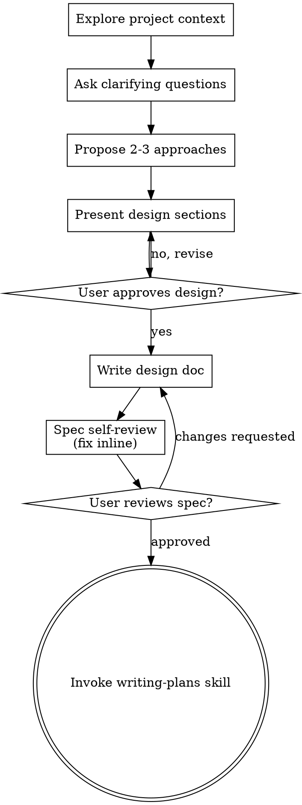

# Prompt Log — CI-CD_and_Test-Harness_Engineering

Extracted from AI-Audit-ThienPhuc.md — 60 user prompts, in order.

---

### 2026-07-11 07:36:30 (UTC)

<command-message>caveman:caveman</command-message>
<command-name>/caveman:caveman</command-name>

---

### 2026-07-11 07:36:35 (UTC)

Switch to caveman  mode. If no level specified, use full. Respond terse like smart caveman — drop articles, filler, pleasantries. Fragments OK. Technical terms exact. Code unchanged. Pattern: [thing] [action] [reason]. [next step].

---

### 2026-07-11 07:37:14 (UTC)

yes

---

### 2026-07-11 08:04:58 (UTC)

i need Github-actions scripts to CI-CD my repo. First, get the test plan in docs folder. Then write testcases for me using framework. Suggesting me first. How about these mocha + chai + supertest, playwright, Jest +RNTL

---

### 2026-07-11 08:10:11 (UTC)

Base directory for this skill: C:\Users\ADMIN\.claude\plugins\cache\claude-plugins-official\superpowers\6.1.1\skills\brainstorming

# Brainstorming Ideas Into Designs

Help turn ideas into fully formed designs and specs through natural collaborative dialogue.

Start by understanding the current project context, then ask questions one at a time to refine the idea. Once you understand what you're building, present the design and get user approval.

<HARD-GATE>
Do NOT invoke any implementation skill, write any code, scaffold any project, or take any implementation action until you have presented a design and the user has approved it. This applies to EVERY project regardless of perceived simplicity.
</HARD-GATE>

## Anti-Pattern: "This Is Too Simple To Need A Design"

Every project goes through this process. A todo list, a single-function utility, a config change — all of them. "Simple" projects are where unexamined assumptions cause the most wasted work. The design can be short (a few sentences for truly simple projects), but you MUST present it and get approval.

## Checklist

You MUST create a task for each of these items and complete them in order:

1. **Explore project context** — check files, docs, recent commits
2. **Offer the visual companion just-in-time** — NOT upfront. The first time a question would genuinely be clearer shown than described, offer it then (its own message); on approval its browser tab opens for you. If no visual question ever arises, never offer it. See the Visual Companion section below.
3. **Ask clarifying questions** — one at a time, understand purpose/constraints/success criteria
4. **Propose 2-3 approaches** — with trade-offs and your recommendation
5. **Present design** — in sections scaled to their complexity, get user approval after each section
6. **Write design doc** — save to `docs/superpowers/specs/YYYY-MM-DD-<topic>-design.md` and commit
7. **Spec self-review** — quick inline check for placeholders, contradictions, ambiguity, scope (see below)
8. **User reviews written spec** — ask user to review the spec file before proceeding
9. **Transition to implementation** — invoke writing-plans skill to create implementation plan

## Process Flow

**The terminal state is invoking writing-plans.** Do NOT invoke frontend-design, mcp-builder, or any other implementation skill. The ONLY skill you invoke after brainstorming is writing-plans.

## The Process

**Understanding the idea:**

- Check out the current project state first (files, docs, recent commits)
- Before asking detailed questions, assess scope: if the request describes multiple independent subsystems (e.g., "build a platform with chat, file storage, billing, and analytics"), flag this immediately. Don't spend questions refining details of a project that needs to be decomposed first.
- If the project is too large for a single spec, help the user decompose into sub-projects: what are the independent pieces, how do they relate, what order should they be built? Then brainstorm the first sub-project through the normal design flow. Each sub-project gets its own spec → plan → implementation cycle.
- For appropriately-scoped projects, ask questions one at a time to refine the idea
- Prefer multiple choice questions when possible, but open-ended is fine too
- Only one question per message - if a topic needs more exploration, break it into multiple questions
- Focus on understanding: purpose, constraints, success criteria

**Exploring approaches:**

- Propose 2-3 different approaches with trade-offs
- Present options conversationally with your recommendation and reasoning
- Lead with your recommended option and explain why

**Presenting the design:**

- Once you believe you understand what you're building, present the design
- Scale each section to its complexity: a few sentences if straightforward, up to 200-300 words if nuanced
- Ask after each section whether it looks right so far
- Cover: architecture, components, data flow, error handling, testing
- Be ready to go back and clarify if something doesn't make sense

**Design for isolation and clarity:**

- Break the system into smaller units that each have one clear purpose, communicate through well-defined interfaces, and can be understood and tested independently
- For each unit, you should be able to answer: what does it do, how do you use it, and what does it depend on?
- Can someone understand what a unit does without reading its internals? Can you change the internals without breaking consumers? If not, the boundaries need work.
- Smaller, well-bounded units are also easier for you to work with - you reason better about code you can hold in context at once, and your edits are more reliable when files are focused. When a file grows large, that's often a signal that it's doing too much.

**Working in existing codebases:**

- Explore the current structure before proposing changes. Follow existing patterns.
- Where existing code has problems that affect the work (e.g., a file that's grown too large, unclear boundaries, tangled responsibilities), include targeted improvements as part of the design - the way a good developer improves code they're working in.
- Don't propose unrelated refactoring. Stay focused on what serves the current goal.

## After the Design

**Documentation:**

- Write the validated design (spec) to `docs/superpowers/specs/YYYY-MM-DD-<topic>-design.md`
  - (User preferences for spec location override this default)
- Use elements-of-style:writing-clearly-and-concisely skill if available
- Commit the design document to git

**Spec Self-Review:**
After writing the spec document, look at it with fresh eyes:

1. **Placeholder scan:** Any "TBD", "TODO", incomplete sections, or vague requirements? Fix them.
2. **Internal consistency:** Do any sections contradict each other? Does the architecture match the feature descriptions?
3. **Scope check:** Is this focused enough for a single implementation plan, or does it need decomposition?
4. **Ambiguity check:** Could any requirement be interpreted two different ways? If so, pick one and make it explicit.

Fix any issues inline. No need to re-review — just fix and move on.

**User Review Gate:**
After the spec review loop passes, ask the user to review the written spec before proceeding:

> "Spec written and committed to `<path>`. Please review it and let me know if you want to make any changes before we start writing out the implementation plan."

Wait for the user's response. If they request changes, make them and re-run the spec review loop. Only proceed once the user approves.

**Implementation:**

- Invoke the writing-plans skill to create a detailed implementation plan
- Do NOT invoke any other skill. writing-plans is the next step.

## Key Principles

- **One question at a time** - Don't overwhelm with multiple questions
- **Multiple choice preferred** - Easier to answer than open-ended when possible
- **YAGNI ruthlessly** - Remove unnecessary features from all designs
- **Explore alternatives** - Always propose 2-3 approaches before settling
- **Incremental validation** - Present design, get approval before moving on
- **Be flexible** - Go back and clarify when something doesn't make sense

## Visual Companion

A browser-based companion for showing mockups, diagrams, and visual options during brainstorming. Available as a tool — not a mode. Accepting the companion means it's available for questions that benefit from visual treatment; it does NOT mean every question goes through the browser.

**Offering the companion (just-in-time):** Do NOT offer it upfront. Wait until a question would genuinely be clearer shown than told — a real mockup / layout / diagram question, not merely a UI *topic*. The first time that happens, offer it then, as its own message:
> "This next part might be easier if I show you — I can put together mockups, diagrams, and comparisons in a browser tab as we go. It's still new and can be token-intensive. Want me to? I'll open it for you."

**This offer MUST be its own message.** Only the offer — no clarifying question, summary, or other content. Wait for the user's response. If they accept, start the server with `--open` so their browser opens to the first screen automatically. If they decline, continue text-only and don't offer again unless they raise it.

**Per-question decision:** Even after the user accepts, decide FOR EACH QUESTION whether to use the browser or the terminal. The test: **would the user understand this better by seeing it than reading it?**

- **Use the browser** for content that IS visual — mockups, wireframes, layout comparisons, architecture diagrams, side-by-side visual designs
- **Use the terminal** for content that is text — requirements questions, conceptual choices, tradeoff lists, A/B/C/D text options, scope decisions

A question about a UI topic is not automatically a visual question. "What does personality mean in this context?" is a conceptual question — use the terminal. "Which wizard layout works better?" is a visual question — use the browser.

If they agree to the companion, read the detailed guide before proceeding:
`skills/brainstorming/visual-companion.md`

---

### 2026-07-11 08:12:08 (UTC)

create a md file to give context of all your works and the instruction guide for another agent

---

### 2026-07-14 15:40:52 (UTC)

<command-message>caveman:caveman</command-message>
<command-name>/caveman:caveman</command-name>

---

### 2026-07-14 15:40:57 (UTC)

Switch to caveman  mode. If no level specified, use full. Respond terse like smart caveman — drop articles, filler, pleasantries. Fragments OK. Technical terms exact. Code unchanged. Pattern: [thing] [action] [reason]. [next step].

---

### 2026-07-14 15:44:38 (UTC)

# Role & Context
You are an expert DevOps, QA/QC Engineer, and Scrum Master. Your task is to generate a comprehensive, highly actionable execution plan for our team to complete the "T07 - CI/CD & Test-Harness Engineering" Seminar. 

## Current Project State
* We already have an automated testing pipeline running successfully on GitHub Actions triggered by Pull Requests and Pushes.
* Our main CI/CD tool for implementation and comparison is Github actions
* Our AI Triage strategy is using Prompt-Engineered LLMs (ChatGPT/Claude) to perform structured log analysis.

## Seminar Requirements & Constraints (Topic T07)
1. **Tool Comparison:** We must run our EShop tests on both Jenkins and GitHub Actions, analyzing the differences (caching, speed, credentials, configuration)[cite: 1].
2. **Flaky Test:** We need to intentionally introduce a flaky test (e.g., timing/sleep-based) and observe it over 10 sequential pipeline runs[cite: 1].
3. **AI vs. Human Triage:** We must compare manual log analysis against an AI-driven triage (using ChatGPT/Claude with a structured prompt) to generate a 3-level hypothesis tree[cite: 1].
4. **Deliverables:** `Tool_Survey_Proposal.md` (Stage S1), `User_Guide.md` (>= 6 sections)[cite: 1], `Demo_Screencast.mp4` (5-8 min, hosted on YouTube), `Activity_Worksheet.md` ("Pipeline Postmortem" classroom activity), and `Seminar_Slides.pptx`[cite: 1].
5. **Evaluation:** Tasks and individual contributions will be assessed strictly via GitHub Commit Logs. Diagrams must use Mermaid. No code-blocks for LaTeX.

---

## Instructions for Agent: Generate the Project Plan
Please analyze the above context and generate a step-by-step sprint plan structured under the following headings. Ensure the plan is highly technical and specific to Node.js/Jest (EShop stack) and Github actions.

### 1. Architectural Diagram (Mermaid)
Draw a Mermaid workflow diagram displaying:
* Developer push/PR triggering both GitHub Actions and local Jenkins server[cite: 1].
* The Jest test execution paths (including the flaky test)[cite: 1].
* The log extraction and dual triage routes (Manual vs. ChatGPT/Claude)[cite: 1].

### 2. Phase-by-Phase Execution Roadmap
Break down the implementation into 4 sequential phases:
* **Phase 1: Jenkins Setup & Feature Parity:** How to set up a local Jenkins controller (via Docker), configure GitHub Webhooks (e.g., using ngrok), and recreate our existing GitHub Actions workflow in a declarative `Jenkinsfile` (including npm caching and Cobertura/JUnit XML test reports)[cite: 1].
* **Phase 2: Flaky Test Inoculation:** Concrete code example of a sleep-based or network-dependency flaky test in Jest[cite: 1]. Instructions on how to trigger the pipeline 10 times to capture the failing log[cite: 1].
* **Phase 3: AI Prompt Engineering & Log Triage:** Define a highly structured "System Prompt" to feed ChatGPT/Claude. This prompt must force the LLM to output a 3-level hypothesis tree and 3 concrete next-checks without hallucinating[cite: 1].
* **Phase 4: Deliverables Assembly & Role Assignment:** A breakdown of how our team of 3 should split the remaining work (User Guide, YouTube Demo Screencast, Interactive Classroom Activity Worksheet, and Slides) to ensure clean, distinct GitHub commit histories[cite: 1].

### 3. Immediate Next Actions (The "To-Do" List)
Provide a clear, prioritized checklist of the first 5 technical actions we must take today to kickstart Phase 1.
After implement all CI/CD handoff, you can skip somethings due to sucessfully implent

---

### 2026-07-14 15:49:06 (UTC)

skip jenkins phase, focus on github actions

---

### 2026-07-14 15:55:53 (UTC)

# Role & Context
You are an expert DevOps Engineer and Scrum Master. We need to revise our "T07 - Sprint Execution Plan" immediately. 

We just received the official "2026 AI-First Seminar Workflow Briefing" from our lecturer, Dr. Lâm Quang Vũ. Our previous plan to "descope Jenkins" and "repurpose Tool_Survey_Proposal.md" violates strict course rules and will result in an automatic penalty or rejection (RECLAIM) at Stage S2.

## Critical Constraints from the 2026 Guidelines:
1. **Rule of Pairing:** Every live demo MUST show one TRADITIONAL feature AND one AI feature.
2. **Jenkins is Mandatory:** We cannot descope Jenkins. We must compare Jenkins (traditional) with GitHub Actions (backup/comparison) as explicitly requested in the T07 brief.
3. **S1 Proposal Document Integrity:** `Tool_Survey_Proposal.md` must remain a strict Tool Survey containing: Topic code, >= 3 candidates (1 traditional, 1+ AI, 1 backup), a 5-axis comparison matrix (cost, curve, EShop fit, AI ability, community), and a 3-bullet rationale.
4. **User_Guide.md Structure:** Must have exactly 7 required sections, including Section 6: "Failure Modes" (detailing >= 3 ways the tool/AI can mislead users).
5. **No Hallucinations:** AI Disclosures (AI-02/03/04) are strictly graded.

---

## Instructions for Agent: Revise the Sprint Plan
Please modify our previous execution plan (`T07_Seminar_Execution_Plan.md`) to align 100% with these official guidelines. 

Generate the updated markdown plan focusing on the following:

### 1. Re-Integrate Jenkins (Without starting from scratch)
* Assign **Engineer A** to run a local Jenkins controller inside Docker.
* Create a declarative `Jenkinsfile` that mirrors our existing `.github/workflows/ci.yml` (Checkout -> NPM Install -> Run Tests -> Upload Cobertura/JUnit Artifacts). This ensures a clean, direct 1-to-1 comparison matrix for the report.

### 2. Restore S1 Proposal Structure
* Restore `Tool_Survey_Proposal.md` to its original survey format (Jenkins vs. GitHub Actions, and ChatGPT/Claude vs. Datadog FTM as an exploratory tool). 

### 3. Hard-code the "Failure Modes" Section (User_Guide Section 6)
* Plan out 3 documented, realistic failure modes of our AI-triage workflow (e.g., ChatGPT hallucinating stack traces when log length exceeds token context limits; failing to diagnose network bottlenecks within private local Jenkins subnets).

### 4. Update Phase Breakdown & Task Ownership
* Update Phase 1 through 4 to include Jenkins pipeline setup, GHA-to-Jenkins telemetry comparison (setup time, run time, caching efficiency), and clean Git commit log ownership for all 3 members (Engineers A, B, and C).

Ensure the output is clean, actionable, and ready to be checked in. Do not use LaTeX inside code blocks.

---

### 2026-07-14 16:03:52 (UTC)

implement important phase and create a checklist for another agent to execute. Your main purpose is help me running a demo video, the report will be dont later due to the checklist.md, also create a script-demo.md

---

### 2026-07-14 18:07:54 (UTC)

kịch bản test hiện tại là gì vậy

---

### 2026-07-14 18:17:20 (UTC)

bạn hãy chạy 1 lượt và kiểm tra tôi đã hoàn thành yêu cầu của seminar chưa

---

### 2026-07-14 18:18:59 (UTC)

bây giờ tôi làm theo script-demo là xong chưa

---

### 2026-07-14 18:22:37 (UTC)

capture đi

---

### 2026-07-14 19:21:37 (UTC)

CS423 / CSC15003 · SEMINAR T07
CI/CD & Test-Harness
Engineering
Automated evidence and AI-assisted flaky-test triage
PROJECT
EShop - SUT
TEAM
Ngô Huỳnh Gia Thoại
Nguyễn Phạm Thiện Phúc
Nguyễn Thiên Phúc
DATE
15 July 2026

A practical path from pipeline design to evidence
02
01
Why CI/CD and test harnesses matter
02
Tool landscape: traditional and AI-augmented
03
EShop as the demonstration system
04
Dual-CI pipeline and evidence workflow
05
Flaky-test experiment and paired triage
06
Findings, lessons, and discussion

Turns every change into reproducible test evidence
03
PROJECT OVERVIEW & OBJECTIVES
Build one repeatable path
• Trigger on push, pull request, or manual dispatch
• Install deterministically with npm ci
• Run guard, specification, flaky, web, admin, and mobile tests
• Publish JUnit, Cobertura coverage, and a badge
Learning outcomes
• Author and explain a pipeline as code
• Compare Jenkins with GitHub Actions
• Observe non-determinism over repeated runs
• Pair manual log analysis with AI triage
• Decide where AI helps—and where it adds noise
Central claim
Automation makes tests useful; disciplined evidence makes AI useful.
Source: spec.md; EShop/.github/workflows/ci.yml; EShop/Jenkinsfile

CI/CD turns commits into releasable candidates
04
CI/CD FUNDAMENTALS
Pipeline flow
COMMIT
versioned change
BUILD
compile + package
TEST
quality gates
RELEASE
releasable artifact
DEPLOY
target environment
Build–test–deploy cycle
← feedback
BUILD
TEST
DEPLOY
Every failed check returns evidence to the next change.
Continuous integration shortens feedback. Continuous delivery keeps the result ready to release.
Source: project brief

CI orchestration trades control for convenience
05
SOFTWARE SURVEY — TRADITIONAL TOOLS
Decision axis
GitHub Actions
Jenkins
GitLab CI
Operating model
Hosted, repo-native
Self-hosted
Integrated platform
Setup effort
Low
High
Medium
Control
Medium
High
Medium–high
Best EShop role
Comparison CI
Traditional baseline
Exploratory option
Survey read
Jenkins maximizes control; GitHub Actions minimizes setup friction.
Source: project survey

AI-augmented Direction
06
SOFTWARE SURVEY — AI-AUGMENTED TOOLS
Decision axis
Datadog FTM
ChatGPT / Claude
Sealights / Launchable
Primary signal
Cross-run flakiness
Failure logs
Code-change impact
Core value
Detect recurring flakes
Explain + propose checks
Select high-value tests
Integration
CI agent + platform
Focused prompt
CI + test history
Tradeoff
Cost + setup
Needs verification
Data maturity required
Best starting point
Use a structured LLM prompt now; add platform analytics when repeated-run history grows.
Source: project survey

The survey favors a staged adoption path
07
KEY TAKEAWAYS FROM THE SURVEY
01
Choose the operating model first
Hosted convenience and self-hosted control create different maintenance costs.
02
Keep the pipeline concepts portable
Build, test, artifacts, gates, and evidence map across all three CI tools.
03
Pair AI with a fixed evidence baseline
The same log and retry history make manual and AI conclusions comparable.
04
Scale AI tooling with data maturity
Prompt-based triage works immediately; analytics and test selection improve with history.
Recommendation
Jenkins + GitHub Actions for CI; structured LLM triage as the first AI layer.
Source: project survey

Connects four clients to one testable backend
08
ESHOP PROJECT INTRODUCTION
CUSTOMER WEB
React + Vite + Tailwind
ADMIN WEB
React + Vite + Playwright
MOBILE APP
React Native + Expo + Jest
TEST HARNESS
Mocha + Chai + Supertest
EXPRESS API
JWT auth
products + carts
orders + profiles
DATA
SQLite
EVIDENCE
JUnit + Cobertura
logs + artifacts
STACK
Node.js / Express / JWT
React / Vite / Expo
Mocha / Playwright / Jest / nyc
Sources: EShop/README.md; package.json; frontend and test configuration

Both CI engines implement the same quality contract
09
PIPELINE ARCHITECTURE - GITHUB ACTIONS AND JENKINS
PUSH
PR / MANUAL
INSTALL
checkout
npm ci + cache
GATE
guard
web + mobile smoke
OBSERVE
spec allowed-fail
flaky x10
PUBLISH
JUnit / coverage
badge / artifacts
IMPLEMENTATION MAP
Quality contract
GitHub Actions
Jenkins
Allowed failure
continue-on-error
catchError -> UNSTABLE
Parallel lanes
jobs + matrix
stages / parallel
Evidence
upload-artifact
junit + recordCoverage
Operations
hosted runner
self-hosted agents
Sources: .github/workflows/ci.yml; Jenkinsfile

The vidence and pipeline debt
10
DEMO HIGHLIGHTS - REAL PIPELINE AND TEST ARTIFACTS
GITHUB ACTIONS #12
Failure - 20s - 1 artifact
Flaky-watch passed; guard/spec/smoke surfaced failures.
TEST RESULTS
Guard  11 / 11 pass
Spec  14 / 14 fail by design
COVERAGE
Coverage
49.34%
ARTIFACT
flaky-run-12
453 B - SHA-256 recorded
Demo reading
Artifacts exist, but run #12 also shows missing spec.xml upload and failing merge gates.
Sources: GitHub Actions run #12 (15 Jul 2026); EShop/coverage/badge.svg; reports/spec.xml

Ten runs turn one failure into a reproducible flaky pattern
11
FLAKY TEST EXPERIMENT - BEFORE / AFTER AND PAIRED TRIAGE
BEFORE
1 failure
Looks deterministic without history
AFTER - 10 RUNS
F
1
P
2
F
3
P
4
P
5
F
6
F
7
P
8
F
9
P
10
5 pass / 5 fail
MANUAL TRIAGE
Read the exact assertion
• 0-80 ms simulated work
• budget is <50 ms
• verify timing and environment
AI-ASSISTED TRIAGE
Broaden the hypothesis tree
• rank code, environment, infrastructure
• suggest the next three checks
• flag claims not present in the log
AI proposes; repeated-run evidence decides.
Source: tests/api/flaky/timing.flaky.test.js; local 10-run experiment on 15 Jul 2026

AI adds breadth quickly - and noise just as quickly
12
FINDINGS - WHERE AI ADDS VALUE AND WHERE IT ADDS NOISE
ADDS VALUE
Compress the evidence
01
Summarizes long logs
02
Builds a ranked hypothesis tree
03
Suggests targeted next checks
04
Compares retry patterns
ADDS NOISE
Invent confidence
01
Overfits a single run
02
Hallucinates files or lines
03
Misses private runner context
04
Repeats generic fixes
Useful AI is constrained by the same evidence a human can inspect.
Finding based on repository evidence, local retries, and the public GitHub Actions run.

AI as a guarded triage layer, not an autonomous gate
13
CONCLUSIONS AND RECOMMENDATIONS
1
GATE
guard + smoke
2
OBSERVE
spec + flaky
3
TRIAGE
focused AI prompt
4
VERIFY
human + rerun
SHIP
with evidence
RECOMMENDED NEXT MOVES
01
Fix guard and smoke reliability before calling the pipeline release-ready.
02
Publish JUnit, Cobertura, retry logs, and artifacts consistently in both CI engines.
03
Feed AI focused logs plus 10-run history; require citations to repository evidence.
04
Verify every diagnosis with a rerun or code inspection before changing production code.
Sources: Jenkinsfile; .github/workflows/ci.yml; repository reports and observed run #12

T07 · CI/CD & TEST-HARNESS ENGINEERING
Questions?
TAKEAWAY
Automate the feedback loop.
Engineer the evidence.
Use AI with verification.
 checkmy slide

---

### 2026-07-21 16:25:26 (UTC)

https://github.com/calebevans/gha-failure-analysis.git repo này có thể dùng cho hệ thống của tôi không

---

### 2026-07-21 16:25:27 (UTC)

<command-message>caveman:caveman</command-message>
<command-name>/caveman:caveman</command-name>
<command-args>ultra</command-args>

---

### 2026-07-21 16:25:32 (UTC)

Switch to caveman ultra mode. If no level specified, use full. Respond terse like smart caveman — drop articles, filler, pleasantries. Fragments OK. Technical terms exact. Code unchanged. Pattern: [thing] [action] [reason]. [next step].

---

### 2026-07-21 17:29:09 (UTC)

yes i do have time for test things now. Maybe if safer to implement this on another new branch

---

### 2026-07-22 05:06:42 (UTC)

can you use this curl http://localhost:11434/v1/chat/completions   -H "Authorization: Bearer ollama"   -H "Content-Type: application/json"   -d '{
    "model": "qwen2.5:7b-instruct ",
    "messages": [{"role": "user", "content": "Test successful?"}]
  }' to test instead of claude api key?

---

### 2026-07-22 05:13:42 (UTC)

là bạn giả sử lỗi chứ không phải chạy pipeline thật đúng không

---

### 2026-07-22 05:29:27 (UTC)

can you find some free api key to test on remote repo with the CI pipeline

---

### 2026-07-22 05:40:13 (UTC)

I have setup secret for Groq API key on GitHub repo with name `MODEL_API_KEY`. However, when creating a new api key in Groq dashboard, I cound not see any models options

---

### 2026-07-22 05:46:21 (UTC)

có

---

### 2026-07-22 05:48:05 (UTC)

push

---

### 2026-07-22 06:01:44 (UTC)

chạy và theo dõi run

---

### 2026-07-22 06:08:58 (UTC)

A

---

### 2026-07-22 06:09:55 (UTC)

<bash-input> & "C:\Program Files\GitHub CLI\gh.exe" auth login --web --git-protocol https</bash-input>

---

### 2026-07-22 06:10:04 (UTC)

<bash-stdout></bash-stdout><bash-stderr>/usr/bin/bash: eval: line 1: syntax error near unexpected token `&amp;'
/usr/bin/bash: eval: line 1: ` &amp; "C:\Program Files\GitHub CLI\gh.exe" auth login --web --git-protocol https'
</bash-stderr>

---

### 2026-07-22 06:18:26 (UTC)

done

---

### 2026-07-22 06:18:50 (UTC)

[Request interrupted by user for tool use]

---

### 2026-07-22 06:19:38 (UTC)

can you change default branch to demo so that we dont need to merge

---

### 2026-07-22 06:29:08 (UTC)

A

---

### 2026-07-22 06:51:23 (UTC)

<task-notification>
<task-id>b6da1uimo</task-id>
<tool-use-id>toolu_01DRPEkjYTc3wv33eKCnoC9Y</tool-use-id>
<output-file>C:\Users\ADMIN\AppData\Local\Temp\claude\D--23127249-QA-CI-CD-and-Test-Harness-Engineering\63886c61-0f0a-44c7-80a0-8140d9337500\tasks\b6da1uimo.output</output-file>
<status>completed</status>

Background command "Watch dispatch run to completion" completed (exit code 0)

</task-notification>

---

### 2026-07-22 06:54:43 (UTC)

kết quả của phiên làm việc vừa rồi là gì

---

### 2026-07-22 07:12:17 (UTC)

giải thích cơ chế mà bạn vừa implement. Xóa bỏ các bước thừa. Liệu chạy rồi thì có file gì lưu lại không, dùng để gọi 1 model khác chạy "bù"

---

### 2026-07-22 07:22:01 (UTC)

chạy đi

---

### 2026-07-22 07:25:06 (UTC)

[Request interrupted by user for tool use]

---

### 2026-07-22 07:25:49 (UTC)

thôi đừng pull check ollama list đi

---

### 2026-07-22 07:34:14 (UTC)

tôi mới tắt bớt app, chạy lại qwen đi

---

### 2026-07-22 07:45:43 (UTC)

Viết user_guide.md cho phần này, sao cho demo được trên repo thật. Tuy nhiên thêm cả phần hướng dẫn để sử dụng qwen local của tôi. Viết bằng tiếng anh, dễ hiểu cho người chưa đụng vào dự án bao giờ có thể step-by-step thực hiện. Keep it simple but effective, đảm bảo dù chạy đơn giản nhưng vẫn đủ các tính chất quan trọng khi chạy trên các hệ thống lớn

---

### 2026-07-22 07:54:12 (UTC)

có cách nào chạy trực tiếp mà không dùng github cli không

---

### 2026-07-22 07:57:03 (UTC)

theo tôi hiểu, CI pipeline được kích hoạt khi push hoặc tạo PR. Sau khi pipeline chạy xong thì ta có được file log, rồi mới đưa file log cho AI đúng không

---

### 2026-07-22 08:03:23 (UTC)

tức là user_guide phải chỉ cho người khác code yml đó, và người ta sẽ trigger github bằng push hoặc tạo PR. Lúc này CI chạy và sau đó gửi log cho AI

---

### 2026-07-22 08:03:38 (UTC)

[Request interrupted by user for tool use]

---

### 2026-07-22 08:07:57 (UTC)

Ngoài ra, giới thiệu về 2 cách bạn nên nói là bất kì api key nào mà người dùng có. Sau đó có thể giới thiệu grop hoặc ollama. Tôi muốn user_guide này áp dụng được ở mọi repo, hoặc ít nhất là các repo có sẵn một source cụ thể gì đó

---

### 2026-07-23 03:36:41 (UTC)

kết hợp với các tiêu chí trong D:\23127249\QA\New folder. Viết lại user_guide, hãy ưu tiên việc gọi api, đây sẽ là flow chính. Việc sử dụng local llm chỉ là một giải pháp để chứng minh flow hoạt động. Ở các file yml, hãy mô tả lại đúng như repo hiện tại tuy nhiên có comment là chỗ này có thể được thay thế nếu bạn sử dụng repo khác. Cho cái output mẫu luôn. Tức là tôi expected nó giống mo tả trong d:\23127249\QA\New folder\README.md. Qwen vừa rồi chạy ra format không giống như kết quả tôi thấy ở github action. Viết bằng tiếng anh hết

---

### 2026-07-23 09:50:08 (UTC)

chúng ta có đáp ứng overview và learning objective trong file txt không.

---

### 2026-07-23 10:09:08 (UTC)

thay vì sử dụng datadog hay diffblue, sử dụng cái chúng ta vừa cài với qodo thay thế được không. Đúng tinh thần seminar không

---

### 2026-07-23 10:50:14 (UTC)

PS D:\23127249\QA\CI-CD_and_Test-Harness_Engineering> diffblue-agents install                  

       █████  ███     ██████     ██████  █████     ████                     
      ░░███  ░░░     ███░░███   ███░░███░░███     ░░███                     
    ███████  ████   ░███ ░░░   ░███ ░░░  ░███████  ░███  █████ ████  ██████ 
   ███░░███ ░░███  ███████    ███████    ░███░░███ ░███ ░░███ ░███  ███░░███
  ░███ ░███  ░███ ░░░███░    ░░░███░     ░███ ░███ ░███  ░███ ░███ ░███████ 
  ░███ ░███  ░███   ░███       ░███      ░███ ░███ ░███  ░███ ░███ ░███░░░  
  ░░████████ █████  █████      █████     ████████  █████ ░░████████░░██████ 
   ░░░░░░░░ ░░░░░  ░░░░░      ░░░░░     ░░░░░░░░  ░░░░░   ░░░░░░░░  ░░░░░░  
                                 A G E N T S
  ──────────────────────────────────────────────────────────────────────────
                           1.2.1-bd89fbe-windows_amd64
  ──────────────────────────────────────────────────────────────────────────
  Diffblue Agents Server: PID 25204, port 57367
  Using agent: GitHub Copilot CLI 1.0.28 (c:\Users\ADMIN\AppData\Roaming\Code\User\globalStorage\github.copilot-chat\copilotCli\copilot)
  ──────────────────────────────────────────────────────────────────────────

   ✓ Successfully configured Claude Code

   Path: C:\Users\ADMIN\AppData\Roaming\npm\claude

PS D:\23127249\QA\CI-CD_and_Test-Harness_Engineering> diffblue-agents run regression-unit-tests
Starting Diffblue Agents server for project: D:\23127249\QA\CI-CD_and_Test-Harness_Engineering
Server started successfully on port 53820 (PID: 30880)

       █████  ███     ██████     ██████  █████     ████                     
      ░░███  ░░░     ███░░███   ███░░███░░███     ░░███                     
    ███████  ████   ░███ ░░░   ░███ ░░░  ░███████  ░███  █████ ████  ██████ 
   ███░░███ ░░███  ███████    ███████    ░███░░███ ░███ ░░███ ░███  ███░░███
  ░███ ░███  ░███ ░░░███░    ░░░███░     ░███ ░███ ░███  ░███ ░███ ░███████ 
  ░███ ░███  ░███   ░███       ░███      ░███ ░███ ░███  ░███ ░███ ░███░░░  
  ░░████████ █████  █████      █████     ████████  █████ ░░████████░░██████ 
   ░░░░░░░░ ░░░░░  ░░░░░      ░░░░░     ░░░░░░░░  ░░░░░   ░░░░░░░░  ░░░░░░  
                                 A G E N T S
  ──────────────────────────────────────────────────────────────────────────
                           1.2.1-bd89fbe-windows_amd64
  ──────────────────────────────────────────────────────────────────────────
  Diffblue Agents Server: PID 30880, port 53820
  Using agent: Claude Code 2.1.205 (C:\Users\ADMIN\AppData\Roaming\npm\claude)
  ──────────────────────────────────────────────────────────────────────────

   Cannot start workflow regression-unit-tests

   The configured AI agent failed validation:

   Failed to start CLI process: Cannot run program "C:\Users\ADMIN\AppData\Roaming\npm\claude" (in directory "C:\Users\ADMIN\.diffblue\agents\cli"): CreateProcess error=193, %1 is not a valid Win32 application

   Command attempted:
   agent "Count the number of files in the current directory..."

   For installation help, see: https://docs.diffblue.com/system-requirements#supported-ai-coding-agent-platforms https://docs.diffblue.com/system-requirements#supported-ai-coding-agent-platforms

   Run diffblue-agents install to reconfigure your agent.

   Press Enter to retry, Escape to exit
 tức là không chạy được phải không

---

### 2026-07-23 10:56:03 (UTC)

<command-message>caveman:caveman</command-message>
<command-name>/caveman:caveman</command-name>

---

### 2026-07-23 10:56:09 (UTC)

Switch to caveman  mode. If no level specified, use full. Respond terse like smart caveman — drop articles, filler, pleasantries. Fragments OK. Technical terms exact. Code unchanged. Pattern: [thing] [action] [reason]. [next step].

---

### 2026-07-23 10:56:25 (UTC)

<command-message>caveman:caveman</command-message>
<command-name>/caveman:caveman</command-name>
<command-args>ultra</command-args>

---

### 2026-07-23 10:56:28 (UTC)

Switch to caveman ultra mode. If no level specified, use full. Respond terse like smart caveman — drop articles, filler, pleasantries. Fragments OK. Technical terms exact. Code unchanged. Pattern: [thing] [action] [reason]. [next step].

---

### 2026-07-23 11:04:17 (UTC)

viết vào D:\23127249\QA\New folder file md về https://docs.diffblue.com/. Giải thích sơ qua về cách hoạt động cũng như cách cài, cũng như việc api_key của tôi không hợp lệ nên không cài được. Viết trên tinh thần đáp ứng các yêu cầu của file txt. Viết bằng tiếng anh

---

### 2026-07-23 11:20:58 (UTC)

viết tương tự cho cái gha D:\23127249\QA\New folder\README.md. Cũng nói what it is how it works, nhưng phần sau thì mình đã có user_guide rồi nên có thể link qua (nó sẽ ở cùng một thư mục).

---

### 2026-07-23 11:39:15 (UTC)

viết 2 cái evalution đó với giọng văn là research thật, chứ không phải là ráng hoàn thành theo yêu cầu file txt. Tôi đã xóa 1 vài chỗ rồi đó

---

### 2026-07-08 11:44:36 (UTC)

viết file python để xuất toàn bộ session này ở dạng md, format như thế này: 
### User:
check the 3 newest commit to nơ what I change, then adding things to submission folder, ì i have not done it yet, create a gap and tell me to fill in

---

