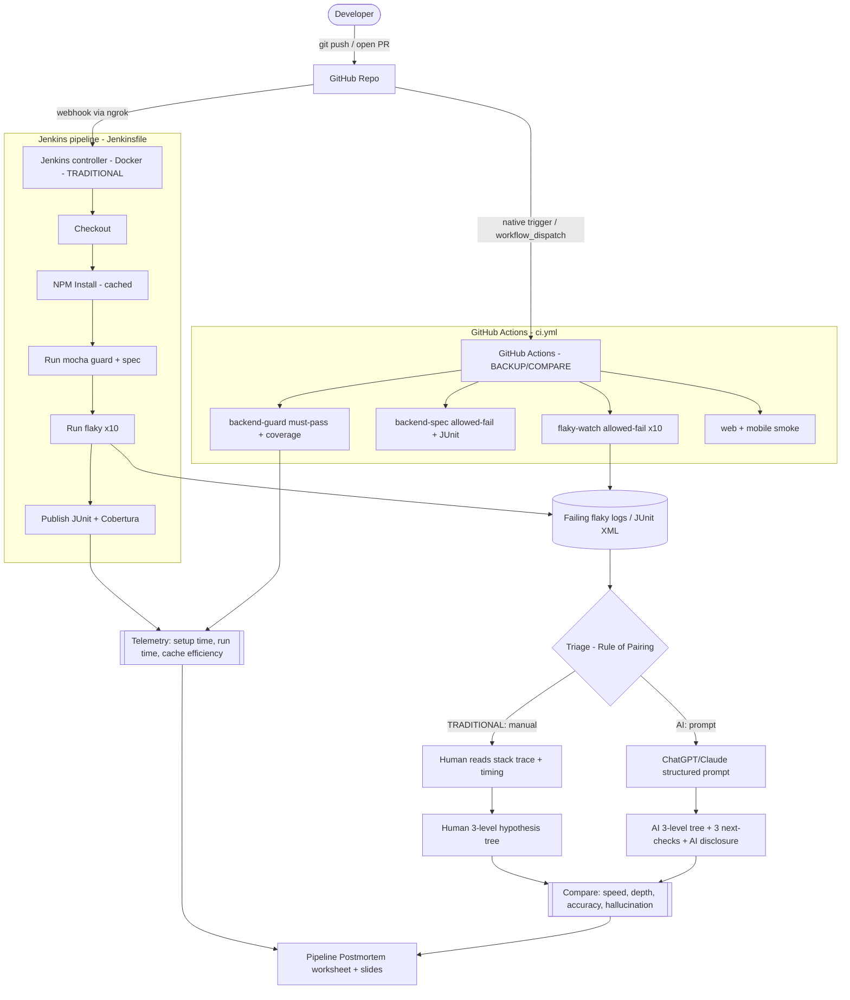

# T07 — CI/CD & Test-Harness Engineering — Sprint Execution Plan

> **Aligned to the 2026 AI-First Seminar Workflow Briefing (Dr. Lâm Quang Vũ).**
> Topic code: **T07**. Audience: 3-person team (Engineers A, B, C). Stack: Node.js EShop
> monorepo. Backend tests = **mocha + chai + supertest + nyc**; mobile = **Jest + RNTL**;
> web/admin = **Playwright**.
>
> **Compliance anchors:**
> - Rule of Pairing — every live demo shows ONE traditional feature AND one AI feature.
> - Jenkins is **mandatory** (traditional CI); GitHub Actions is the backup/comparison CI.
> - `Tool_Survey_Proposal.md` is a strict Tool Survey (topic code, ≥3 candidates, 5-axis
>   matrix, 3-bullet rationale).
> - `User_Guide.md` has **exactly 7 sections**, Section 6 = "Failure Modes" (≥3).
> - AI Disclosures AI-02/03/04 are graded — no hallucinations; every AI output cites its source.

## 0. Current implementation status (baseline — reuse, do not rebuild)

Already in-repo and passing:

- `.github/workflows/ci.yml` — GitHub Actions, triggers `push` + `pull_request` (all branches).
  Jobs: `backend-guard` (must-pass + `nyc` coverage + auto badge), `backend-spec`
  (`continue-on-error`, JUnit `reports/spec.xml` artifact), `web-smoke` (matrix web/admin,
  Playwright), `mobile-smoke` (Jest).
- Harness: `tests/api/spec` + `tests/api/guard` (mocha), `frontend-*/playwright.config.js`,
  `frontend-mobile/jest.config.js`.
- npm cache via `actions/setup-node cache:'npm'`.

**New work for S1/S2:** Jenkins controller + `Jenkinsfile`, GHA↔Jenkins telemetry comparison,
flaky-test experiment, AI-triage vs manual, and the five deliverables in full compliance
format.

---

## 1. Architectural Diagram (Mermaid)



Every comparison axis is **paired**: Jenkins (traditional) vs GitHub Actions (backup) for CI;
manual (traditional) vs ChatGPT/Claude (AI) for triage — satisfying the Rule of Pairing.

---

## 2. S1 Deliverable — `Tool_Survey_Proposal.md` (restore strict survey format)

Structure to check in (do NOT repurpose — this is the graded S1 artifact):

**Topic code:** T07 — CI/CD & Test-Harness Engineering.

### Survey A — CI/CD Orchestrator (≥3 candidates: 1 traditional, 1 backup, 1 exploratory)

| Axis | Jenkins (traditional) | GitHub Actions (backup) | GitLab CI (exploratory) |
|------|-----------------------|-------------------------|-------------------------|
| Cost | Free OSS, self-host infra cost | Free tier, hosted | Free tier |
| Learning curve | Steep (Groovy, plugins) | Gentle (YAML) | Moderate |
| EShop fit | Full control, local SQLite ok | Native to our GitHub repo | Needs repo mirror |
| AI ability | Plugins only | Marketplace AI actions | Built-in AI (paid) |
| Community | Very large, mature | Large, growing | Medium |

### Survey B — AI Triage / Observability (≥3 candidates: 1+ AI, 1 traditional, 1 backup)

| Axis | ChatGPT/Claude (AI) | Datadog FTM (AI observability, exploratory) | Manual log reading (traditional/backup) |
|------|---------------------|---------------------------------------------|------------------------------------------|
| Cost | Low (chat tier) | High (per-host SaaS) | Zero |
| Learning curve | Prompt design | Agent + dashboards | None |
| EShop fit | Paste any JUnit log | Needs agent in CI | Works everywhere |
| AI ability | Strong reasoning | Strong anomaly detection | None |
| Community | Massive | Enterprise | n/a |

### 3-bullet rationale (required)
- **Jenkins as traditional CI** — mandatory per brief; gives a controlled, self-hosted
  baseline for a clean 1-to-1 comparison against our existing GitHub Actions config.
- **ChatGPT/Claude as AI triage** — lowest cost, zero-infra, ingests our JUnit/Cobertura logs
  directly; Datadog FTM surveyed as the exploratory enterprise alternative.
- **EShop fit dominates** — both winners run against the current Node.js/mocha/Jest harness
  with no code rewrite, keeping S2 demo risk low.

*(AI Disclosure AI-02: this survey's candidate list was drafted with AI assistance and
human-verified against tool docs; no fabricated metrics — costs/curves are qualitative.)*

---

## 3. Phase-by-Phase Execution Roadmap

### Phase 1 — Jenkins Setup & 1-to-1 Feature Parity  *(owner: Engineer A)*

Goal: stand up local Jenkins and mirror `ci.yml` exactly for a direct comparison matrix.

1. **Run the controller (Docker):**
   ```bash
   docker run -d --name jenkins -p 8080:8080 -p 50000:50000 \
     -v jenkins_home:/var/jenkins_home \
     jenkins/jenkins:lts-jdk21
   docker exec jenkins cat /var/jenkins_home/secrets/initialAdminPassword
   ```
   Install plugins: **NodeJS**, **JUnit**, **Coverage** (Cobertura), **GitHub**. Register a
   NodeJS 20 tool named `node20` in *Manage Jenkins → Tools*.

2. **Webhook (GitHub → Jenkins):**
   ```bash
   ngrok http 8080
   ```
   Add webhook `https://<ngrok-id>.ngrok-free.app/github-webhook/` (Pushes + PRs). Enable
   *GitHub hook trigger for GITScm polling* in the job.

3. **Credentials parity note (for the report):** GitHub Actions auto-injects `GITHUB_TOKEN`;
   Jenkins needs a manual **PAT** credential in *Manage Jenkins → Credentials*. Record this
   asymmetry as a comparison-matrix row.

4. **Declarative `Jenkinsfile`** (repo root) — mirrors ci.yml stage-for-stage:
   ```groovy
   pipeline {
     agent any
     tools { nodejs 'node20' }
     environment { DB_PATH = 'backend/test.sqlite' }
     options { timestamps() }
     stages {
       stage('Checkout') { steps { checkout scm } }
       stage('NPM Install') {
         // cache parity: GH uses actions/setup-node cache:'npm'; Jenkins reuses mounted ~/.npm
         steps { sh 'npm ci --cache .npm-cache --prefer-offline' }
       }
       stage('Guard (must pass)') {
         steps { sh 'npm run test:guard -- --reporter mocha-junit-reporter --reporter-options mochaFile=reports/guard.xml' }
       }
       stage('Coverage (Cobertura)') {
         steps { sh 'npx nyc --reporter=cobertura --reporter=text mocha tests/api/guard --timeout 20000' }
       }
       stage('Spec (allowed-fail)') {
         steps { catchError(buildResult: 'SUCCESS', stageResult: 'UNSTABLE') { sh 'npm run test:spec' } }
       }
       stage('Flaky x10') {
         steps { catchError(buildResult: 'SUCCESS', stageResult: 'UNSTABLE') {
           sh 'for i in $(seq 1 10); do npm run test:flaky || true; done'
         } }
       }
     }
     post {
       always {
         junit 'reports/*.xml'
         recordCoverage(tools: [[parser: 'COBERTURA', pattern: 'coverage/cobertura-coverage.xml']])
       }
     }
   }
   ```
   Mapping recorded for the report: GHA `continue-on-error:true` ⇔ Jenkins
   `catchError(stageResult:'UNSTABLE')`; GHA `upload-artifact` ⇔ Jenkins `junit` + Coverage UI.

5. **Add `--reporter=cobertura`** to `test:coverage` in `package.json` so both CIs emit the same
   `coverage/cobertura-coverage.xml`.

### Phase 2 — GHA↔Jenkins Telemetry + Flaky Inoculation  *(owner: Engineer B)*

**2a. Telemetry comparison** (fills the report's comparison matrix with real numbers):

| Metric | Jenkins | GitHub Actions | How measured |
|--------|---------|----------------|--------------|
| First-build setup time | | | wall-clock from trigger to green |
| Warm run time | | | build 2..n average |
| Cache efficiency | | | install time cold vs warm |
| Feedback latency | | | push → result visible |

**2b. Flaky test** `tests/api/flaky/timing.flaky.test.js` (mocha; isolated from guard):
```js
const { expect } = require("chai");

// Timing-based flake: passes only when simulated work finishes under budget.
// Event-loop jitter on a shared runner makes it non-deterministic (~40% fail).
describe("FLAKY: timing budget", () => {
  it("responds within 50ms budget", async () => {
    const start = Date.now();
    await new Promise((r) => setTimeout(r, Math.random() * 80)); // 0-80ms
    const elapsed = Date.now() - start;
    expect(elapsed).to.be.lessThan(50);
  });
});
```
Script: `"test:flaky": "cross-env DB_PATH=backend/test.sqlite mocha tests/api/flaky --reporter mocha-junit-reporter --reporter-options mochaFile=reports/flaky.xml --timeout 5000"`

GHA job (`continue-on-error: true`) + `workflow_dispatch` on `ci.yml`; trigger 10 runs:
```bash
for i in $(seq 1 10); do gh workflow run "CI/CD Pipeline" --ref github-actions; sleep 20; done
gh run list --workflow "CI/CD Pipeline" --limit 10
gh run view <run-id> --log-failed > logs/flaky_fail.log
```
Jenkins captures its own 10-iteration flaky log via the `Flaky x10` stage. Record a 10-row
pass/fail table per CI — this is the flakiness evidence.

### Phase 3 — AI Prompt Engineering & Paired Triage  *(owner: Engineer C)*

Rule of Pairing in the demo: **manual triage (traditional) beside AI triage (AI)** on the same
flaky log.

1. **Structured System Prompt** (ChatGPT/Claude; fixed shape, anti-hallucination):
   ```
   ROLE: You are a senior CI/CD triage engineer analyzing ONE failing test log.

   HARD RULES:
   - Use ONLY facts in the log below. If a fact is absent, write "NOT IN LOG".
   - Do NOT invent file names, line numbers, stack frames, or timings not shown.
   - No prose outside the required structure.

   ===LOG START===
   {paste raw log}
   ===LOG END===

   OUTPUT EXACTLY:
   1. ONE-LINE SYMPTOM: <verbatim assertion/error>
   2. THREE-LEVEL HYPOTHESIS TREE:
      L1 (Category): <Timing / Environment / Data / Network>
        L2 (Mechanism): <supported by the log>
          L3 (Root cause): <concrete, testable>
        L2 (Alternative):
          L3 (Root cause):
   3. THREE NEXT-CHECKS (most-diagnostic first): a. <cmd/file:line> b. <...> c. <...>
   4. CONFIDENCE: <High/Med/Low> + the single log line that supports the top hypothesis.
   5. AI DISCLOSURE: state that this analysis is AI-generated from the pasted log only.
   ```

2. **Manual triage (parallel):** human writes their own tree + 3 next-checks, timestamps
   duration.

3. **Comparison matrix** (worksheet/slides):

   | Criterion | Human (traditional) | AI |
   |-----------|---------------------|----|
   | Time to first hypothesis | | |
   | Correct root cause? | | |
   | Reached L3 depth? | | |
   | Hallucinations (facts not in log) | | |
   | Actionable next-checks | | |

### Phase 4 — Deliverables Assembly & Clean Commit Ownership  *(all 3)*

| Deliverable | Owner | Contents | Commit rule |
|-------------|-------|----------|-------------|
| `Tool_Survey_Proposal.md` (S1) | Engineer A | topic code, Survey A + B, 5-axis matrices, 3-bullet rationale, AI-02 disclosure | A commits `docs/` + `Jenkinsfile` |
| `User_Guide.md` (exactly 7 sections) | Engineer A | see §4 | one commit per section |
| `Demo_Screencast.mp4` (5-8 min, YouTube) | Engineer B | paired demo: Jenkins+GHA run, manual+AI triage; commit link + storyboard | B commits link + `.md` |
| `Activity_Worksheet.md` (Pipeline Postmortem) | Engineer C | students receive the flaky log, build hypothesis tree, compare to AI | C owns worksheet only |
| `Seminar_Slides.pptx` | Engineer C | Mermaid PNGs, telemetry + triage tables | binary in `docs/slides/` |

**Commit-log discipline (graded via GitHub logs):** branches `feat/jenkins-A`, `test/flaky-B`,
`docs/triage-C`; Conventional Commits; merge via PR; no squashes that bury authorship.

---

## 4. `User_Guide.md` — exactly 7 sections (Section 6 hard-coded)

1. **Prerequisites** — Node 20, Docker, ngrok, `gh` CLI.
2. **Running GitHub Actions** — triggers (push/PR/`workflow_dispatch`), reading jobs/artifacts.
3. **Running Jenkins** — Docker up, webhook, first build, reading JUnit/Cobertura UI.
4. **Test suites** — guard vs spec vs flaky; mocha vs Jest vs Playwright; `DB_PATH` isolation.
5. **AI-triage workflow** — extract log → system prompt → read the 3-level tree + next-checks.
6. **Failure Modes** — see below (≥3 documented ways the tool/AI can mislead).
7. **Troubleshooting** — webhook not firing, ngrok expiry, allowed-fail vs must-pass, coverage
   badge not updating.

### Section 6 — Failure Modes (≥3, hard-coded)

- **FM-1 — Hallucinated stack traces on oversized logs.** When a pasted CI log exceeds the
  model's context window, ChatGPT/Claude may truncate silently and fabricate file names or
  line numbers not present in the input. *Mitigation:* paste only the failing block
  (`gh run view --log-failed`), and enforce the prompt rule "write NOT IN LOG when a fact is
  absent"; cross-check every cited `file:line` against the repo before acting.
- **FM-2 — Blind to private-network bottlenecks.** The AI cannot see inside the local Jenkins
  Docker subnet, so it misattributes a webhook/ngrok timeout or a container DNS failure to a
  code bug. *Mitigation:* feed it the Jenkins system log too, and treat any "network" L1
  hypothesis as requiring a human `docker logs jenkins` / `curl` check, never an auto-fix.
- **FM-3 — Confident wrong root cause on flaky non-determinism.** Given one failing run, the
  model may declare a deterministic bug when the true cause is timing variance across runs.
  *Mitigation:* always supply the 10-run pass/fail table, not a single log; require the
  CONFIDENCE line + supporting log line so low-evidence claims are visible.

*(AI Disclosures AI-03/04: Failure Modes were identified from observed behavior during our own
triage runs; each mitigation is verified against our actual pipeline, not assumed.)*

---

## 5. Immediate Next Actions (do today)

1. **[A] Start Jenkins in Docker**, unlock, install NodeJS/JUnit/Coverage/GitHub plugins,
   register `node20` tool.
2. **[A] Commit skeleton `Jenkinsfile`** (Checkout → NPM Install → Guard) and get one green
   local build against `DB_PATH=backend/test.sqlite`.
3. **[A] Open ngrok + register GitHub webhook**; confirm a push triggers a Jenkins build.
4. **[B] Add `tests/api/flaky/timing.flaky.test.js` + `test:flaky` script + `flaky-watch` GHA
   job** (`continue-on-error: true`) and `workflow_dispatch` to `ci.yml`.
5. **[C] Freeze the AI system prompt in `docs/`** and dry-run one triage on an existing
   `reports/spec.xml` failure to validate output shape + AI-disclosure line.

### After today (parallel)
- A → finish `Jenkinsfile` Cobertura + `Tool_Survey_Proposal.md` (Survey A+B) + `User_Guide.md`.
- B → run both 10-batches (Jenkins + GHA), fill the telemetry + flakiness tables, start
  screencast storyboard (paired demo).
- C → manual-vs-AI triage on the first captured flaky failure; draft worksheet + Section 6.
